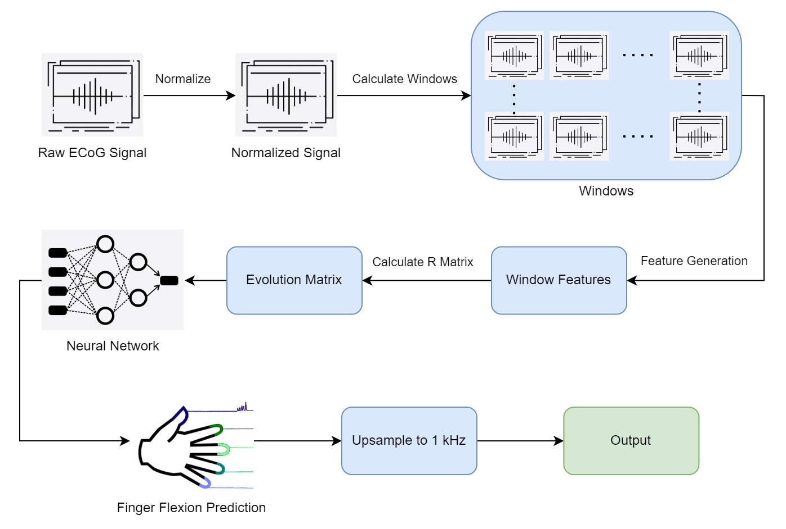

# Predicting Finger Flexions using Electrocorticographic Signals

This project has been implemented by the group HADES as a requirement for the Final Project for the Spring 2022 cohort of the BE-521 course at the University of Pennsylvania. The team comprised of [Ankit Billa](https://github.com/MeteoRex11), Daniel Kang & Harsh Parekh.

## Dataset

The dataset used for the project is from the 4th International Brain Computer Interfaces Competition, the details of which can be found [here](https://www.bbci.de/competition/iv/).

---

## Installation

```
git clone https://github.com/MeteoRex11/tiktok-virality-prediction
cd tiktok-virality-prediction
pip install einops torch pytorch_lightning numpy matplotlib sk-video moviepy
```

<details>
  <summary> Dependencies (click to expand) </summary>
  
  ## Dependencies
  - pytorch
  - pytorch_lightning
  - einops
  - matplotlib
  - numpy
  - scikit-video
  - moviepy
  
</details>

## How To Run?

### Quick Start

### 1. Data Pre-Processing

```
run CIS_519_Team_Project_Preprocessing.ipynb
```

---

### 2. Model Training & Testing
```
cd ViViT/
```
To train the model: 

```
python train.py
```

To test the model: 

```
python test.py
```

## Basic Usage:
```python
img = torch.ones([1, 134, 3, 240, 240])

image_size = 240
patch_size = 16
num_classes = 2
num_frames = 134
num_epochs = 30
dim = 128

model = ViViT(image_size, patch_size, num_classes, num_frames, dim)
model = model.to(device)

parameters = filter(lambda p: p.requires_grad, model.parameters())
parameters = sum([np.prod(p.size()) for p in parameters]) / 1_000_000
print('Trainable Parameters: %.3fM' % parameters)

output = model(img)

print("Shape of model output :", output.shape)      # [B, num_classes]
```
---

## Pipeline



## Citation:
```

```

## Acknowledgement:
* 
* 
