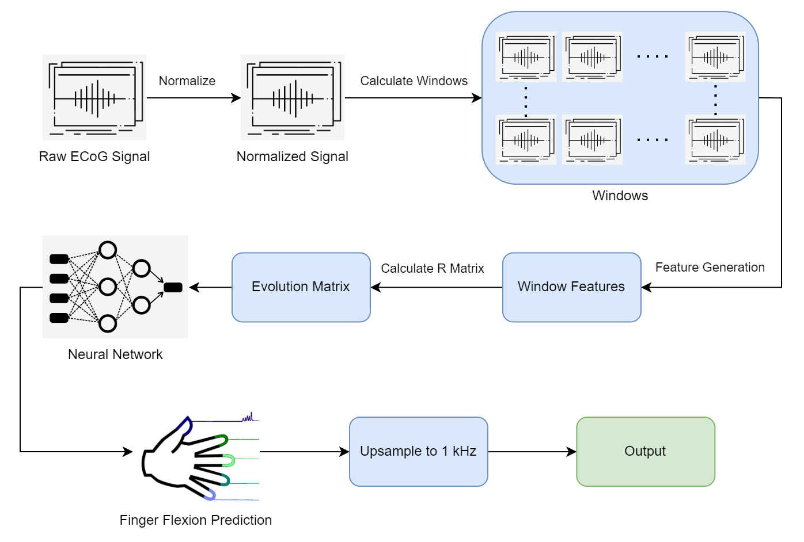

# Predicting Finger Flexions using Electrocorticographic Signals

This project has been implemented by the group HADES for the Final Project for the Spring 2022 cohort of the BE-521 course at the University of Pennsylvania.
The team comprised of
[Ankit Billa](https://github.com/MeteoRex11),
[Daniel Kang](https://github.com/danielkwhitetiger), and
[Harsh Parekh](https://github.com/hXtreme).

## Dataset

The dataset used for the project is from the _4th International Brain Computer Interfaces Competition_, the details of which can be found [here](https://www.bbci.de/competition/iv/).


## Installation

```
git clone https://github.com/hXtreme/2022-be521-project.git
cd 2022-be521-project
pip install -e .
```

## How To Run?

### Setup directories

Create `./data`, `./preds`, `./models` directories.

```sh
mkdir -p data preds models
```

Download `leaderboard_data.mat` and `raw_training_data.mat` and save it to `./data`.

### Run existing pipelines

You can setup and run an existing `Pipeline` with just two lines of code!

```py
my_pipeline = pipeline.windowed_feature_pipelines.MLP2(
    fs=sample_rate,
    window_length=window_length,
    window_displacement=window_displacement,
    history=number_of_windows_of_history,
    layers=(256, 1024, 512, 256),  # Model architechture.
)
hades.pipeline.run_pipeline(my_pipeline, "./data", "./preds", dump_model=True);
```

The above two lines set up and run the following entire pipeline:



### Setting up custom pipelines

It is also very easy to setup your own pipeline.
Your pipeline just needs to inherit from `hades.pipeline.Pipeline` and implement `_fit` and `_predict` methods and you are set.
If you would like more control to add additional pre/post-processing logic you can override the
`pre_process_X`, `pre_process_eval_X`, `pre_process_Y`, and `post_process_Y` function to add that functionality.

You can also build on top of our `WindowedFeaturePipeline` that generates an Evolution Matrix by inheriting from it instead of `Pipeline` and implementing the `features` property to return a list of feature functions.
Additionally, to modify feature matrix before generating the Evolution Matrix you can override the `features_hook` and `features_hook_eval` methods.
These hooks come in particularly handy if you want to use dimension reductionality techniques on the feature matrix.

### Output

Upon running:

```py
hades.pipeline.run_pipeline(my_pipeline, "./data", "./preds", dump_model=True);
```

A model corresponding to the pipeline will be trained, and predictions will be stored as a `mat` file
with an appropritate name under `./preds`.
Since, in this example we also pass `dump_model=True`, after training the
pipeline will be pickled and stored in `./models` under a folder with an appropriate name
for each of the three subjects.


## Citation:

Please cite us if you use our work in any meaningful capacity.

```LaTeX
@misc{hades,
  url = {https://github.com/hXtreme/2022-be521-project},
  author = {Billa, A. and Kang, D. and Parekh H.},
  title = {HADES: BE521 Final Project},
  year = {2022},
  copyright = {All rights reserved, licensed under MIT}
}
```

## Acknowledgement:

- This work wouldn't have been possible without our Prof. Litt's expert guidance and insightful lectures.
- Heartfelt thanks to our TAs for setting up an interesting final project.
- Thanks to Daniel for pushing up to work harder by catering food :wink:
